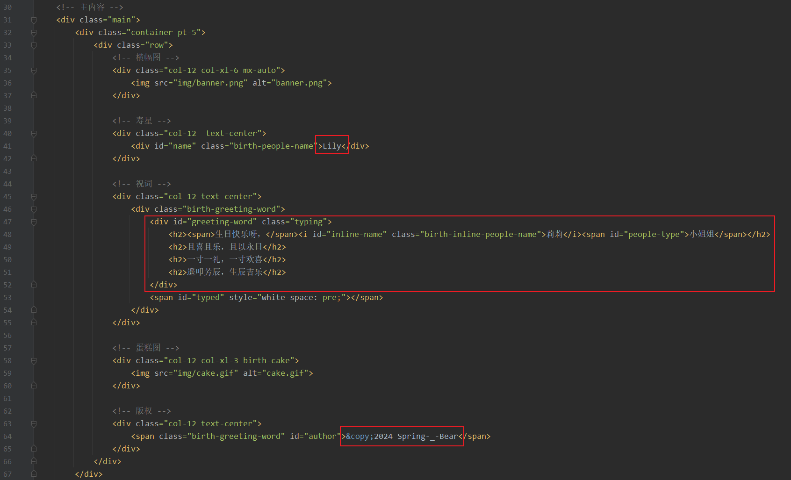
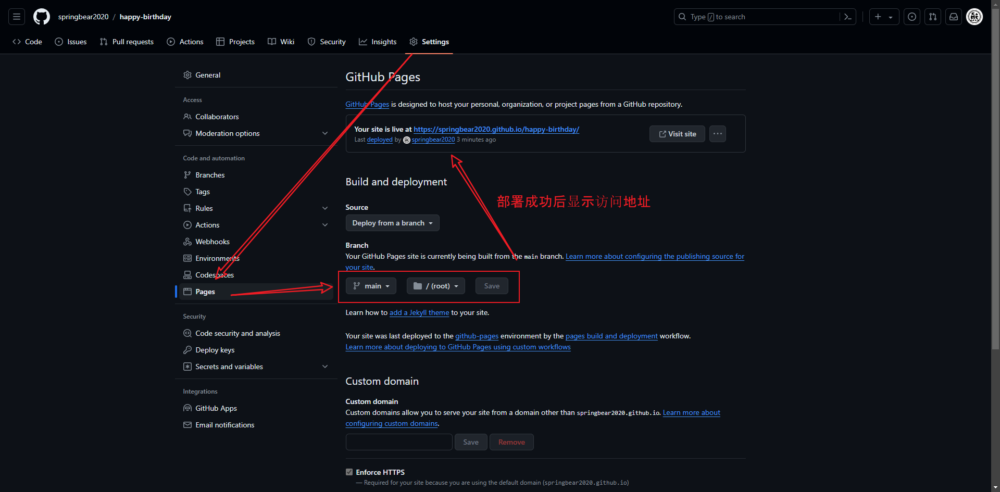

<p align="center">
    
    
    
    <a href="https://springbear2020.github.io/happy-birthday" target="_blank">
        
    </a>
    <a href="https://github.com/springbear2020/happy-birthday" target="_blank">
        
    </a>
</p>

# 一、项目介绍

[happy-birthday](https://github.com/springbear2020/happy-birthday) 是基于 `jQuery + Bootstrap` 构建的响应式生日快乐祝福网站。在 [原仓库](https://github.com/ProgrammerGaurav/happy-birthday) 基础上优化工程结构、修复已知问题，增加额外功能。

# 二、效果展示

> 在线预览：[https://springbear2020.github.io/happy-birthday](https://springbear2020.github.io/happy-birthday)

1. 生日倒计时：雪花飞舞，今年生日已过则展示距明年生日的时间

   - 桌面端：

     

   - 移动端：

     

2. 来吧展示：生日当天点击【来吧，展示】按钮即可跳转生日祝福主页面

   - 桌面端：

     

   - 移动端：

     

3. 生日祝福：`背景音乐 + 姓名摇摆 + 动态祝词 + 蛋糕动图 + 气球飞舞 + 五彩丝带`

   - 桌面端：

     

   - 移动端：

     

# 三、工程结构

```lua
happy-birthday
├── css
    ├── lib
    	└── bootstrap.min.css
    └── index.css
├── docs
├── img
├── js
	├── lib
		├── dayjs.min.js
		├── jquery.min.js
		├── snowflakes.min.js
		└── typed.min.js
	├── confetti.js
	└── index.js
├── music
├── .gitignore
├── favicon.ico
├── index.html
├── LICENSE
└── README.md
```

# 四、技术选型

| 技术       | 说明          | 官网                                  |
| :--------- | :------------ | :------------------------------------ |
| Bootstrap  | 响应式框架    | https://github.com/twbs/bootstrap     |
| jQuery     | JavaScript 库 | https://github.com/jquery/jquery      |
| Day.js     | 时间处理      | https://github.com/iamkun/dayjs       |
| Snowflakes | 雪花飞舞      | https://github.com/hcodes/snowflakes  |
| Typed.js   | 动态文字      | https://github.com/mattboldt/typed.js |

# 五、环境搭建

1. `Fork` [本仓库](https://github.com/springbear2020/happy-birthday) 到您的 `GitHub` 账户仓库中

2. 根据您的个人定制化需求依次修改以下内容：

   - `index.html`：按需求依次修改寿星、祝词和版权部分内容

     

   - `js/index.js`：修改 `birthdayMap` 常量中的值为您的目标生日集合，示例如下：

     ```js
     const birthdayMap = {
         2024: "2024-05-12",
         2025: "2025-04-20",
         2026: "2026-05-09",
         2027: "2027-04-29",
         2028: "2028-04-17",
         2029: "2029-05-06",
         2030: "2030-04-25",
     }
     ```

3. 将您的 `happy-birthday` 项目部署到 `GitHub Pages` 即可实现访问

   

# 六、许可证

```
MIT License

Copyright (c) 2024 春天熊

Permission is hereby granted, free of charge, to any person obtaining a copy
of this software and associated documentation files (the "Software"), to deal
in the Software without restriction, including without limitation the rights
to use, copy, modify, merge, publish, distribute, sublicense, and/or sell
copies of the Software, and to permit persons to whom the Software is
furnished to do so, subject to the following conditions:

The above copyright notice and this permission notice shall be included in all
copies or substantial portions of the Software.

THE SOFTWARE IS PROVIDED "AS IS", WITHOUT WARRANTY OF ANY KIND, EXPRESS OR
IMPLIED, INCLUDING BUT NOT LIMITED TO THE WARRANTIES OF MERCHANTABILITY,
FITNESS FOR A PARTICULAR PURPOSE AND NONINFRINGEMENT. IN NO EVENT SHALL THE
AUTHORS OR COPYRIGHT HOLDERS BE LIABLE FOR ANY CLAIM, DAMAGES OR OTHER
LIABILITY, WHETHER IN AN ACTION OF CONTRACT, TORT OR OTHERWISE, ARISING FROM,
OUT OF OR IN CONNECTION WITH THE SOFTWARE OR THE USE OR OTHER DEALINGS IN THE
SOFTWARE.
```

